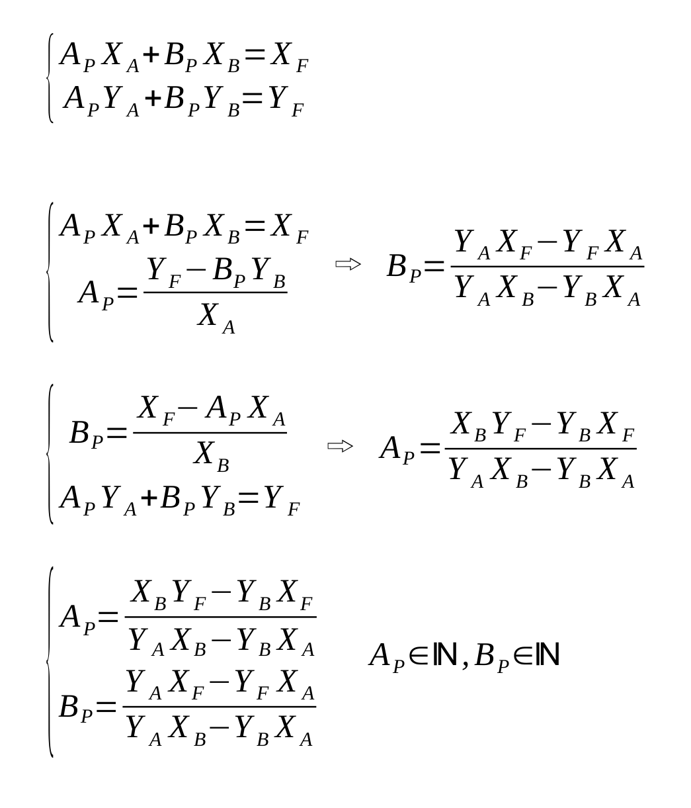

# Day 13: Claw Contraption

You can solve it with a bit of math. This is a system in 2 variables. Given that

- XA, YA the shift when you press 'A' button
- XB, YB the shift when you press 'B' button
- XF, YF coordinates at destination
- You can only increase the position (going right or forward)
- AP, BP are the A presses and B presses needed
- All the numbers are integers so the remainder of division must always be zero

The spreadsheet attached will solve both part1 and part2 of day13.
