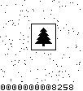

# Day 14: Restroom Redoubt

To find the easter egg you can dump the robot matrix point by point into pbm images with
```
robots.py -p2 -w 101 -t 103 -s 10000 input
```
then use [pbm2mp4.sh](pbm2mp4.sh) to convert it into an mp4 video. I watched the video at 1.5x until I found the Christmas tree. A timestamp is written into each frame to get the solution to part 2.


